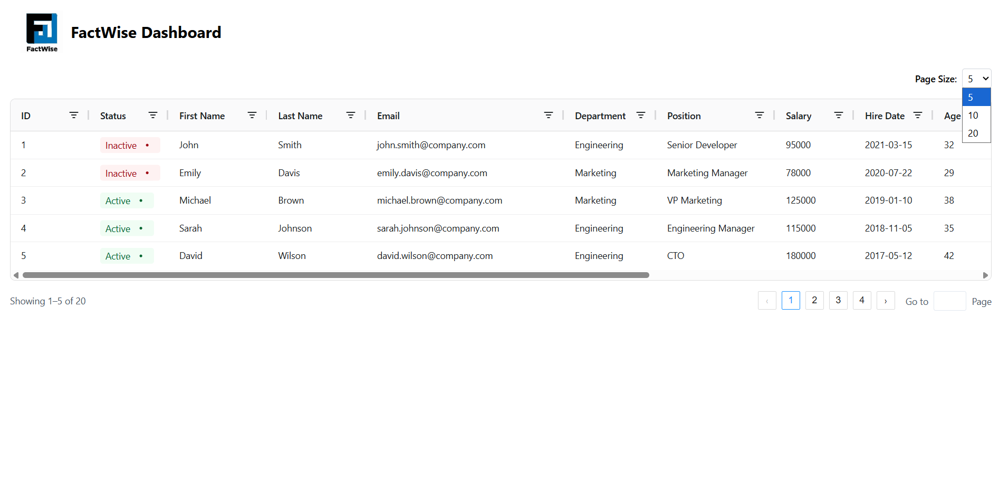

# Project Name

FactWise Assignment

## About

Dashboard of FactWise here we can see the Tabular Data of the Employee in AG Grid Table with the option of filter & sort and Pagination

## Screenshot

## Features

- AG Grid Table
- Pagination
- Filter & Sort (In Build with Ag Grid table)

## Time Spent

- Frontend -- 4 Hours

## Usage

- For Frontend

1. Clone the Repo and install dependency thorough npm install
2. Start the development server using `npm run dev`.
3. Open your browser and navigate to `http://localhost:5173/`.

## Technologies Used

- React
- typescript
- Shadcn UI
- HTML/CSS

## Contributing

If you'd like to contribute to this project, please follow these steps:

1. Fork the repository.
2. Create a new branch (`git checkout -b feature/your-feature`).
3. Commit your changes (`git commit -am 'Add some feature'`).
4. Push to the branch (`git push origin feature/your-feature`).
5. Create a new Pull Request.

## Contact

- [Vishal Mahale](mailto:vishalmahale974@gmail.com)
